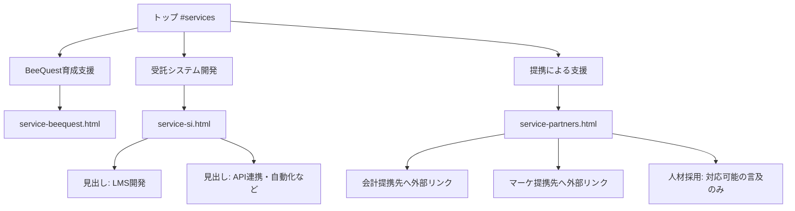

# サービス情報設計（正本）

最終更新: 2026-08-03

## 全体方針

トップのサービス紹介は **3カード** に絞る。  
旧「教育プロダクト / システム開発 / 変革支援」メガメニューと6サービスカードは廃止する。

## 1. BeeQuest育成支援

### 見せ方

- サービス名の見せ方: **BeeQuest育成支援**
- トップでは価値提案を短く。機能の詳細説明は詳細ページ（および beequest.app）へ

### 核となるメッセージ

- BeeQuestアプリを使い、社内の教育・評価・オンボーディング、キャリアの見通しまで設計する
- 社員のモチベーションを高め、「自ら提案できる会社づくり」を支援する
- 採用投資に見合うかの検証や評価システムは、今後機能として展開予定である旨を盛り込む
- 初期伴走から導入後運用、成長を見据えた長期支援を明記する

### 会計コンテンツの扱い

- 「会計教育コンテンツの単体提供」は行わない
- 自社オリジナルの会計教育コンテンツは **BeeQuestの中で学んでもらう** 形で表現する

## 2. 受託システム開発

### 見せ方

- 「概ねどんなアプリでも開発できる」方向性
- AIで設計できる部分を活用し、従来数千万円規模になり得たコストを抑えつつ、ニーズにフォーカスした迅速な提案・実装・運用を行う
- エンジニアが在籍している点を強みとしてアピール
- LMS開発、API・プラグイン、ワークフロー自動化は **受託開発の中の能力・見出し** として含める

### 伴走

- 単なる構築で終わらず、業務効率化や売上向上など目的に合わせ、戦略策定〜ニーズ汲み取り〜実装計画〜活用まで一貫支援
- 他社からのアプリ受注実績がある旨を伝える

## 3. 提携による支援

自社で詳細ページを個別に持たず、提携支援としてまとめ、提携先HPへリンクする。

| 領域 | 扱い |
|---|---|
| 会計（エクス会計、エクスフリマなど） | 提携支援。外部リンク |
| マーケティング支援（SEO等） | 提携支援。外部リンク |
| 人材採用支援 | 対応可能であることのみ示す。現時点ではHP・リンク掲載なし |

## ナビ構成（確定）

メガメニューは3カラム（各柱）またはフラットな3リンクに簡素化する。

| ラベル | リンク |
|---|---|
| BeeQuest育成支援 | `service-beequest.html` |
| 受託システム開発 | `service-si.html` |
| 提携による支援 | `service-partners.html` |
